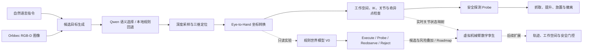

# Lebai Vision Agent

## 基于 RGB-D、多模态大模型与语义—几何世界模型的具身智能操作系统

本地 `/ui/` 已增加模块化机械臂三维预览、只读反馈、虚拟摄像头和场景配置，见[三维集成运行说明](documentation/guides/ROBOT3D_CN.md)。该集成不改变 `docs/` 的线上静态预览。

> A safety-first vision-language robotic manipulation system that turns natural-language instructions into verified robot actions.

> 🌐 [在线查看世界模型控制台](https://doy369.github.io/lebai_LM3_agant/)（静态界面预览；实时感知与真机控制需要本地后端及硬件）

本项目面向真实桌面抓取场景，将 **Orbbec RGB-D 感知、Qwen 多模态语义理解、Eye-to-Hand 手眼标定、语义—几何世界模型、乐白机械臂控制和 Web 可视化**整合为一套端到端系统。用户只需输入“抓取红色杯子”一类自然语言指令，系统即可完成目标选择、三维定位、候选动作推演、运动学验证、安全探测和抓放执行。

它不是简单地“让大模型控制机械臂”，而是构建了一条从开放语义到确定性执行的具身智能链路：世界模型负责理解当前状态、比较候选动作并显式表达风险；安全控制器负责把所有动作约束在可验证、可拒绝、可追溯的执行边界内。

在这个项目中，我重点解决了机器人系统中三个比“识别出物体”更困难的问题：

- 如何把开放式自然语言可靠地映射到**真实场景中的受约束目标**；
- 如何把二维像素和深度数据转换为**机械臂可执行的三维坐标**；
- 如何保证感知或模型出现误差时，系统仍然能够**拒绝危险动作并安全失败**。

## 工程成果

| 维度 | 已实现结果 |
| --- | --- |
| 端到端能力 | 自然语言指令 → RGB-D 目标选择 → 三维定位 → 安全探测 → 抓取与放置 |
| 标定质量 | 一次实机标定使用 18 个有效样本，中位单视图重投影误差约 **0.13 px** |
| 服务能力 | 使用 FastAPI 提供 **30 个 HTTP 接口**，覆盖相机、标定、规划、机器人控制与实验模块 |
| 安全设计 | 实现 Dry-run、显式真机授权、工作空间、IK、关节限位、奇异点、超时停止、运动互斥和探测锁等约束 |
| 工程验证 | **32 项离线测试通过**，覆盖核心安全状态、坐标转换、接口鉴权和世界模型决策 |
| 世界模型 | 实现可解释语义—几何世界模型 V0，对候选动作进行成功率、碰撞、滑移与不确定性联合评估 |
| 决策闭环 | 输出 `execute / probe / reobserve / reject` 四态决策，并保存世界状态、候选排序与试验日志 |
| 数字孪生 | 内置 Three.js 与 Lebai LM3 GLB 模型，实现六关节交互、视角控制及真实关节状态的可选同步 |

> **核心工程判断：** 大模型负责判断“抓什么”，RGB-D 与标定模块负责计算“在哪里”，确定性的安全控制器负责判断“能不能动、应该怎么动”。

模型能力被限制在语义决策层：Qwen 只能从系统生成的候选目标中选择，不能绕过深度测量、坐标变换或运动学检查直接控制机械臂。这种分层让系统既能利用多模态模型的泛化能力，又保留机器人执行所需的确定性和可验证性。

## 关键挑战与解决方案

| 工程挑战 | 解决方案 | 体现的能力 |
| --- | --- | --- |
| 大模型可能输出不存在的目标或不可靠坐标 | 先由 RGB-D 生成候选，再限制模型只能返回合法 `candidate_id`；异常响应拒绝或回退到本地规则 | AI 系统约束、结构化输出、降级设计 |
| 图像坐标无法直接用于机械臂运动 | 结合深度、相机内参、畸变校正和 `base_T_camera` 外参完成像素到 Base 坐标转换 | 计算机视觉、三维几何、手眼标定 |
| 标定样本中可能存在误检和离群点 | 自动采样棋盘格与机器人位姿，使用稳健阈值过滤高重投影误差样本，校验通过后再替换旧结果 | 数据质量控制、原子更新、故障保护 |
| 真机误动作可能造成碰撞 | 将工作空间、IK、关节范围、奇异点、运动互斥、超时停止和一次性探测锁设为硬约束 | 机器人安全、状态机、并发控制 |
| 硬件环境难以随时复现 | 默认 Dry-run，并为机械臂与相机边界建立可测试接口和离线回归测试 | 可测试架构、软硬件解耦 |
| 研究算法需要持续迭代 | 将世界状态、候选动作、预测和试验结果结构化保存，使规则模型可被后续学习模型替换 | 系统建模、实验设计、可扩展架构 |

## 核心能力

- **自然语言目标选择**：使用 Qwen 理解颜色、类别、方位和相对关系等抓取指令。
- **RGB-D 几何定位**：从彩色图像与对齐深度图中生成候选区域，并进行目标深度采样。
- **手眼坐标转换**：完成像素坐标、相机坐标和机械臂 Base 坐标之间的双向转换。
- **自动手眼标定**：围绕操作员确认的初始姿态执行小范围采样，自动检测棋盘格、过滤异常样本并生成标定结果。
- **安全运动控制**：在动作执行前检查工作空间、IK 可达性、关节范围、腕部奇异点和机器人运行状态。
- **两阶段真机流程**：先执行低风险安全探测，再通过一次性探测锁授权对应抓取，降低感知误差带来的真机风险。
- **Web 控制台**：提供相机预览、目标规划、自动标定、安全探测、抓放控制、点动、急停和日志查看等功能。
- **Dry-run 验证**：默认不发送真实运动命令，可在无机械臂环境下验证规划、接口和安全逻辑。
- **语义—几何世界模型**：把语义置信度、深度质量、标定不确定性与运动学余量统一编码为结构化世界状态，对候选动作进行风险排序并给出 `execute`、`probe`、`reobserve` 或 `reject` 决策。
- **虚拟机械臂 / 数字孪生**：基于内置 Three.js 与 Lebai LM3 GLB 模型实现六关节交互、轨道视角和真实关节状态同步；虚拟滑块与真机控制严格隔离，不会向机械臂发送动作。

## 系统架构



完整主链路如下：

```text
自然语言 + RGB-D 图像
        ↓
深度候选区域生成
        ↓
Qwen 从受约束候选中选择目标
        ↓
目标像素深度采样
        ↓
相机坐标 → 机械臂 Base 坐标
        ↓
工作空间 / IK / 关节限位 / 奇异点检查
        ↓
安全探测 → 探测锁确认 → 完整抓放
```

## 技术栈

| 层级 | 技术与组件 |
| --- | --- |
| 开发语言 | Python 3.11、JavaScript、HTML、CSS |
| 视觉与几何 | OpenCV、NumPy、Orbbec RGB-D SDK |
| 智能决策 | Qwen 多模态模型、DashScope 兼容接口、本地规则回退 |
| 世界建模 | 结构化世界状态、候选动作生成、风险预测、四态决策与试验日志 |
| 机器人控制 | Lebai SDK、逆运动学、笛卡尔与关节空间运动 |
| Web 服务 | FastAPI、Pydantic、Uvicorn、原生 Web 前端 |
| 3D 数字孪生 | Three.js r165、GLTFLoader、OrbitControls、Lebai LM3 GLB、关节状态事件同步 |
| 工程验证 | unittest、FastAPI TestClient、Dry-run |

## 关键设计

### 1. 受约束的大模型决策

系统不会直接采用模型生成的三维坐标。视觉模块首先根据 RGB-D 数据生成候选区域，再让 Qwen 从候选集合中选择最符合自然语言指令的目标。模型返回未知候选或不合法结构时，系统会拒绝结果或回退到本地规则规划。

因此，大模型只承担语义层面的开放决策，实际位置由深度数据、相机内参和手眼外参确定。

### 2. Eye-to-Hand 手眼标定

固定相机采用眼在手外配置。坐标转换链路为：

```text
像素 (u, v) + 深度 Z
        ↓ 相机内参与畸变校正
相机坐标 P_camera
        ↓ base_T_camera
机械臂 Base 坐标 P_base
```

自动标定模块能够生成小范围 TCP 姿态扰动、采集棋盘格图像与机器人位姿，并通过稳健阈值剔除高误差样本。一次实机标定实验使用了 18 个有效样本，中位单视图重投影误差约为 **0.13 px**。该指标用于描述棋盘格角点重投影质量，不等同于末端抓取定位误差。真实设备数据未公开，仓库中的标定文件为仅供离线测试的合成示例。

### 3. 分层安全约束

真机动作必须经过多层校验：

1. 默认使用 Dry-run，真机模式需要显式授权。
2. 控制接口支持令牌认证，认证信息仅通过环境变量提供。
3. 所有目标点必须位于配置的工作空间内。
4. 执行前检查 IK、关节范围、腕部奇异点和机器人状态。
5. 运动请求使用互斥锁，避免并发控制机械臂。
6. 运动超时会主动发送停止命令。
7. 完整抓取需要匹配且未过期的一次性安全探测锁。
8. 标定结果变化后，已有探测锁立即失效。

### 4. 可解释的语义—几何世界模型

`world_model_experiment/` 是面向机器人决策的独立研究模块。它将感知结果从“一次目标检测”提升为可计算、可比较、可回放的结构化世界状态，并让每个候选动作在执行前接受显式风险推演。

```text
RGB-D 观测 + 语言目标 + 标定状态 + 机器人状态
                         ↓
                  结构化世界状态
                         ↓
             候选抓取动作与运动学约束
                         ↓
       成功率 / 碰撞 / 滑移 / 不确定性联合评估
                         ↓
         Execute / Probe / Reobserve / Reject
                         ↓
              试验日志与后续学习数据
```

当前的规则世界模型 V0 重点建模：

- 目标语义置信度；
- 深度观测质量；
- 标定有效性与外参不确定性；
- 工作空间余量、路径间隙、关节余量和奇异点余量。

与只输出单一置信度的规划器不同，该模块把“立即执行”“先做低风险探测”“重新观测”和“拒绝动作”建模为不同决策，使系统在信息不足时能够主动选择更安全的下一步。所有分析结果都会保存为结构化试验记录，为未来训练学习型成功率模型或状态转移模型提供统一数据接口。

该模块目前仅用于只读规划实验，不会连接或驱动机械臂，不会绕过主系统的硬安全约束，也不是已经训练完成的学习型世界模型。

### 5. 虚拟机械臂与数字孪生展示层

前端已经内置 Three.js r165、GLTFLoader、OrbitControls 与 `Lebai_LM3.glb`，无需依赖外部 CDN 即可加载机械臂模型。模型暴露 `Joint1` 至 `Joint6` 六个关节节点，并建立了从 Web 控件或机器人状态到 3D 姿态的映射。

当前已实现：

- 六关节弧度滑块与模型姿态实时联动；
- 旋转、缩放、自动环绕、视图适配和零位复位；
- 通过 `lebai:robot-status` 事件读取 `actual_joint_pose`，可选择跟随真实机械臂关节状态；
- 模型与 Three.js 依赖全部本地托管，GitHub Pages 可独立展示；
- 虚拟操作与真机控制严格解耦，滑块只改变数字模型，不发送任何运动指令。

```text
手动关节滑块 ──────────────┐
                           ├─> 六关节姿态映射 ─> Lebai LM3 虚拟机械臂
机器人 actual_joint_pose ─┘                         ↓
                                          视角控制与状态反馈
```

下一阶段将把世界模型候选抓取位姿、TCP、工作空间、预测轨迹和安全门控叠加到同一 3D 场景，让数字孪生从“状态同步”进一步演进为“决策解释与试验回放”界面。

> **能力边界：** 当前实现属于可交互的可视化数字孪生，不是带碰撞求解和动力学计算的物理仿真器；所有真机动作仍由后端安全控制器负责。

## 项目结构

```text
.
├── apps/
│   ├── calibration/                   # 数据采集、标定求解与验证入口
│   ├── demos/                         # Qwen、视觉与抓取 Dry-run
│   ├── robot/                         # 真机探测与两阶段抓取入口
│   └── web/                           # FastAPI 服务入口
├── configs/
│   └── camera/                        # 可公开的相机配置示例
├── documentation/
│   └── guides/                        # 使用与自动标定指南
├── tests/                             # 安全、兼容性与结构回归测试
├── tools/                             # 摄像头枚举等开发工具
├── biaoding/                          # 标定结果
├── robot_system/
│   ├── calibration/                   # 标定求解与自动标定
│   ├── config/                        # 统一路径配置
│   ├── control/                       # 乐白机械臂安全控制
│   ├── llm/                           # Qwen 与规则决策
│   ├── pipeline/                      # 抓取流程编排
│   ├── vision/                        # RGB-D 相机与坐标转换
│   └── web/                           # FastAPI 与 Web 控制台
├── world_model_experiment/            # 结构化世界模型实验
├── 01_...py ～ 11_...py               # 旧命令兼容包装器
├── pyproject.toml                     # 包元数据与稳定 CLI 入口
├── requirements-core.txt
├── requirements-web.txt
├── requirements-optional.txt
└── requirements-dev.txt
```

`apps/` 只负责稳定入口，核心能力继续保留在 `robot_system/`；根目录编号脚本是临时兼容层。新旧命令映射见[第一阶段兼容说明](documentation/guides/COMPATIBILITY.md)。

## 环境要求

推荐开发环境：

- Windows 10/11；
- Python 3.11；
- Orbbec Gemini 系列 RGB-D 相机；
- 乐白机械臂及对应版本的 `lebai_sdk`；
- 机械臂与运行电脑处于同一可信局域网。

其中相机 SDK、机械臂 SDK 和 Qwen API 均为可选能力。仅运行 Dry-run 和部分离线演示时，不需要连接真实硬件。

## 快速开始

### 1. 创建虚拟环境

```powershell
python -m venv .venv
Set-ExecutionPolicy -Scope Process -ExecutionPolicy Bypass
.\.venv\Scripts\Activate.ps1
python -m pip install --upgrade pip
```

### 2. 安装依赖

核心模块：

```powershell
pip install -r requirements-core.txt
```

Web 控制台：

```powershell
pip install -r requirements-web.txt
```

测试依赖：

```powershell
pip install -r requirements-dev.txt
```

安装项目及工程化命令入口：

```powershell
pip install -e ".[dev]"
```

真实相机和机械臂所需的可选依赖：

```powershell
pip install -r requirements-optional.txt
```

不同版本的乐白 SDK 可能采用不同分发方式。如厂商提供本地 wheel，请按照厂商文档安装对应文件。

### 3. 运行 Dry-run

所有首次运行都建议保持 Dry-run：

```powershell
$env:LEBAI_DRY_RUN="1"
lebai-pick-demo
```

原命令 `python .\06_full_pick_pipeline_demo.py` 仍由兼容层支持。

### 4. 启动 Web 控制台

```powershell
$env:LEBAI_DRY_RUN="1"
lebai-web
```

原命令 `python .\09_module4_fastapi_backend.py` 仍然有效。

启动后访问：

- Web 控制台：`http://127.0.0.1:8001/ui/`
- OpenAPI 文档：`http://127.0.0.1:8001/docs`
- 健康检查：`http://127.0.0.1:8001/api/health`

### 5. 启用 Qwen

Qwen API Key 只应通过当前终端或操作系统的环境变量提供：

```powershell
$env:QWEN_API_KEY="<your-api-key>"
$env:QWEN_MODEL="<model-name>"
```

请勿将真实密钥写入源码、启动脚本、截图、日志或 Git 提交历史。未配置模型时，支持的流程会使用本地候选规则回退，或明确返回模型不可用状态。

## 推荐验证顺序

在接入真机之前，建议按以下顺序验证：

1. 检查标定文件和相机分辨率是否匹配；
2. 运行 Qwen 决策演示；
3. 验证像素、相机与 Base 坐标转换；
4. 运行机械臂控制 Dry-run；
5. 运行完整抓取链路 Dry-run；
6. 在操作员看护和急停可用的条件下执行安全探测；
7. 确认探测位置正确后，再执行与该探测锁匹配的抓取。

更完整的使用说明见 [USAGE_CN.md](documentation/guides/USAGE_CN.md)，自动标定说明见 [AUTO_CALIBRATION_CN.md](documentation/guides/AUTO_CALIBRATION_CN.md)。

## 测试

运行主系统安全测试：

```powershell
python -m unittest discover -v -s .\tests -p "test_*.py"
```

原测试命令 `python -m unittest -v test_safety_hardening.py test_probe_lock_flow.py` 继续兼容。

运行世界模型实验测试：

```powershell
python -m unittest discover -v -s .\world_model_experiment\tests -p "test_*.py"
```

当前共有 **35 项离线测试**，覆盖：

- Web 控制接口认证；
- 真机显式授权与安全默认值；
- 工作空间、深度单位和坐标投影；
- 自动标定失败时保护已有结果；
- 运动超时停止和并发运动互斥；
- 探测锁创建、过期、失效与一次性消费；
- 世界模型候选生成、风险决策和试验日志；
- 世界模型 Web 接口的只读属性。
- 新旧命令入口映射、CLI 可导入性与统一路径解析。

离线测试通过不代表已经完成所有真机安全认证。真实运动仍需在受控环境中由操作员逐步验证。

## 主要接口

系统提供 30 个 HTTP 接口，主要分为：

- `system`：健康检查、运行配置和示例请求；
- `calibration`：标定状态、自动标定计划与执行；
- `camera`：相机状态、设备自检、当前画面与规划结果；
- `robot`：状态、启停、急停、夹爪、示教模式和 TCP 点动；
- `agent`：候选目标规划与当前画面规划；
- `pipeline`：安全探测、完整抓取和当前画面抓取；
- `experiment`：世界模型状态与只读规划实验。

完整请求模型和返回结构可在服务启动后通过 `/docs` 查看。

## 安全与隐私

- 仓库不需要、也不应该包含任何真实 API Key、访问令牌或密码。
- 机器人地址、控制令牌和模型密钥应通过环境变量或本地私有配置提供。
- 仓库中的相机参数和手眼标定结果是合成示例，严禁直接用于真实机械臂运动。
- 标定文件与相机内参通常只适用于对应设备和安装位置，不能直接复制到另一套硬件使用。
- 禁止仅根据模型输出跳过标定、运动学检查或安全探测。
- 真机运行时应确保工作区域清空、急停可用，并由操作员全程看护。

## 当前边界与后续方向

当前项目属于科研与工程验证原型，已经完成 RGB-D 感知、语义目标选择、坐标转换、安全运动控制、Web 控制和 Dry-run 测试链路。仍可继续完善：

- 收集真实抓取数据，报告抓取成功率、定位误差和端到端延迟；
- 增加抓取后的视觉验证与失败恢复；
- 使用真实试验数据训练学习型成功率或状态转移模型；
- 增加场景级目标跟踪、遮挡处理和多视角重观测；
- 在现有 GLB 虚拟机械臂上叠加 TCP、候选抓取位姿、预测轨迹与安全边界；
- 为无硬件用户提供可复现的数据样例和物理仿真环境；
- 增加持续集成与跨平台离线测试。

---

如果你正在阅读本项目以了解其工程思路，可以从 `apps/demos/full_pick_pipeline.py`、`robot_system/pipeline/pick_executor.py` 和 `robot_system/control/lebai_controller.py` 开始，它们分别展示了稳定入口、模块编排和安全执行逻辑。
